# Manual de usuario — BarberSite Pro

**Versión del documento:** 1.1 · Mayo 2026  
**Sistema:** BarberSite / Barber Pro Web  
**Desarrollo:** k3v1bvo Studios  

> **Cómo leer este manual:** Los diagramas usan sintaxis Mermaid. En GitHub, GitLab o VS Code con vista previa se ven como gráficos. Si solo ve texto/código, use un visor Markdown compatible o exporte a PDF desde VS Code.

---

## Tabla de contenidos

**Fundamentos**

1. [Introducción general](#1-introducción-general)  
   - [Diagramas y mapas del sistema](#16-diagramas-y-mapas-del-sistema)  
   - [Referencia rápida por rol](#17-referencia-rápida-por-rol)  
2. [Acceso al sistema](#2-acceso-al-sistema)

**Por perfil de usuario**

3. [Perfil administrador](#3-perfil-administrador)  
4. [Perfil recepcionista](#4-perfil-recepcionista)  
5. [Perfil barbero](#5-perfil-barbero)  
6. [Perfil cliente](#6-perfil-cliente)

**Módulos transversales**

7. [Sistema de notificaciones](#7-sistema-de-notificaciones)  
8. [Control de asistencia](#8-control-de-asistencia)  
9. [Sitio público (sin login)](#9-sitio-público-sin-login)

**Cierre**

10. [Recomendaciones y seguridad](#10-recomendaciones-y-seguridad)  
11. [Funciones pendientes o limitadas](#11-funciones-pendientes-o-limitadas)  
12. [Soporte, glosario y FAQ](#12-soporte-glosario-y-faq)  
13. [Anexo: índice de diagramas](#13-anexo-índice-de-diagramas)

---

## 1. Introducción general

### 1.1 Descripción del sistema

**BarberSite Pro** es una plataforma web para barberías que integra en un solo lugar:

- Reserva de citas en línea y en mostrador (POS)
- Gestión de agenda por barbero y vista general del salón
- Control de asistencia del personal
- Tienda de productos y pedidos
- Panel administrativo con reportes, inventario y usuarios
- Notificaciones dentro del sistema y por correo electrónico

La interfaz utiliza un diseño oscuro profesional (colores **ámbar** y **zinc**), adaptable a computadora, tablet y móvil.

### 1.2 Objetivo del sistema

| Objetivo | Cómo lo cumple el sistema |
|----------|---------------------------|
| Organizar citas | Agenda general, agenda por barbero, estados de reserva |
| Controlar al personal | Reloj de asistencia, panel admin, cierre automático de turnos |
| Vender servicios y productos | Recepción, finalización de citas, tienda y pedidos |
| Fidelizar clientes | Club de lealtad (visitas y descuentos) |
| Informar en tiempo real | Campana de notificaciones y correos automáticos |

### 1.3 Funcionalidades principales

- Landing pública con servicios, galería/portafolio, tienda y contacto
- Registro e inicio de sesión por roles
- Reservas con selección de barbero, servicio, fecha y hora
- Recepción del día (día / semana / mes)
- Calendario visual con vistas por barbero
- Horario semanal y bloqueos (vacaciones, días libres)
- Asistencia: entrada, salida, alertas y corrección admin
- Notificaciones in-app y email (Resend)
- Administración de usuarios, servicios, inventario, portafolio y pedidos

### 1.4 Tipos de usuarios y roles

| Rol | Quién es | Acceso principal |
|-----|----------|------------------|
| **Cliente** | Persona que agenda o compra | `/cliente`, `/reservar`, `/calendario`, `/tienda` |
| **Barbero** | Especialista del salón | `/barbero`, `/agenda/[su-id]`, asistencia |
| **Recepcionista** | Caja / front desk | `/recepcion`, `/agenda`, `/reservar` |
| **Administrador** | Dueño o gerente | Todo lo anterior + `/admin/*` |

> El sistema usa **un solo login** (`/login`). Después de autenticarse, cada usuario es redirigido automáticamente a su panel según el rol guardado en su perfil.

### 1.5 Recomendaciones generales de uso

1. Use **Chrome o Edge** actualizado para la mejor experiencia.
2. Cierre sesión al terminar el turno en equipos compartidos (menú de usuario → Cerrar sesión).
3. Mantenga el **reloj del dispositivo** con hora correcta (afecta citas y asistencia).
4. El personal debe marcar **entrada y salida** todos los días laborables.
5. El administrador debe revisar el **panel de asistencia** y la **campana de notificaciones** al iniciar la jornada.

---

### 1.6 Diagramas y mapas del sistema

#### Arquitectura general (capas)

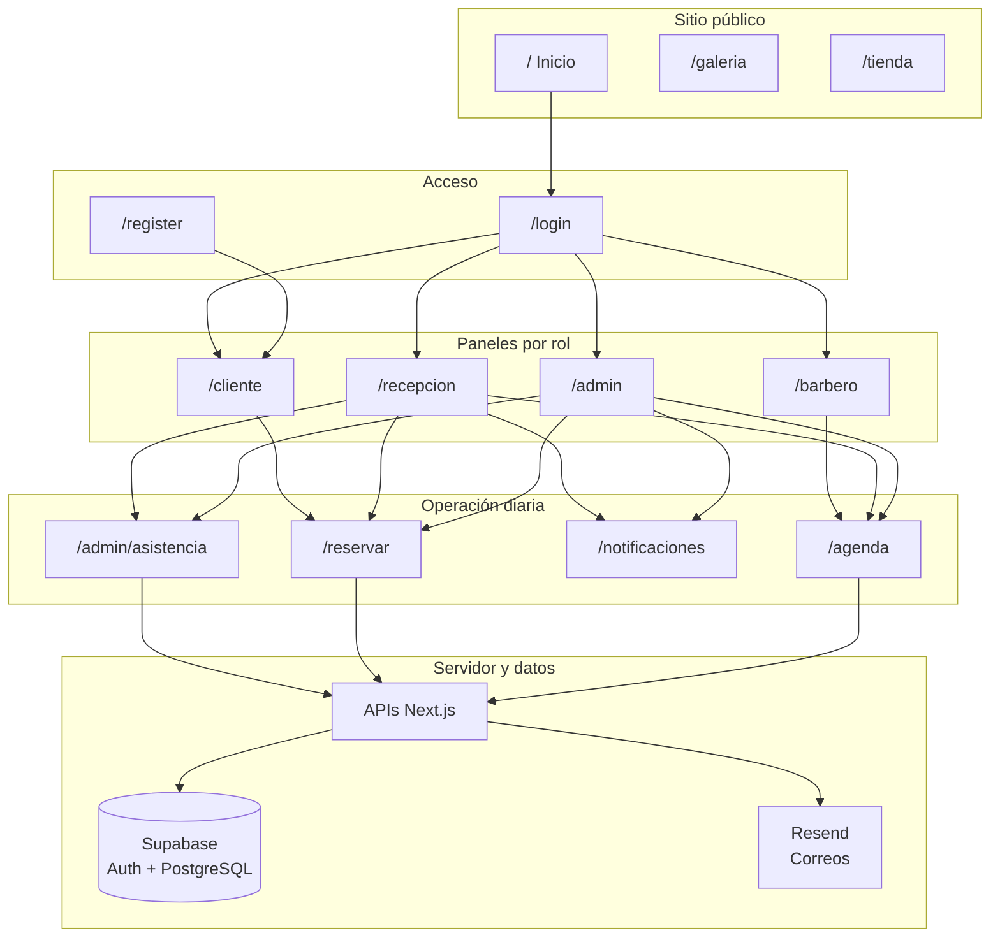

#### Mapa del sitio (navegación principal)

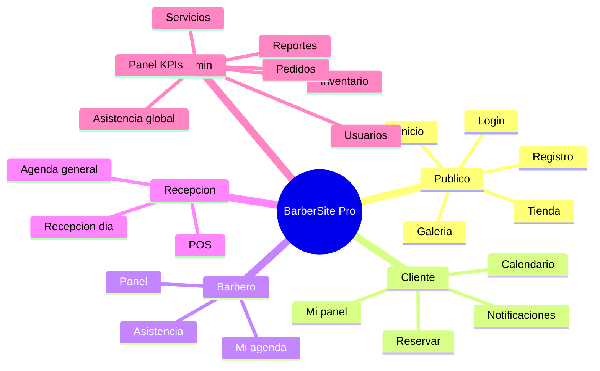

#### Matriz de permisos (resumen)

| Acción | Cliente | Barbero | Recepción | Admin |
|--------|:-------:|:-------:|:---------:|:-----:|
| Reservar cita en línea | ✅ | ✅* | ✅ | ✅ |
| Ver agenda de todos | ❌ | ❌ | ✅ | ✅ |
| Ver su propia agenda | ❌ | ✅ | ❌ | ✅ |
| Marcar asistencia | ❌ | ✅ | ✅ | ❌ |
| Corregir asistencia | ❌ | ❌ | ❌ | ✅ |
| Finalizar / cobrar cita | ❌ | ⚠️** | ✅ | ✅ |
| Crear usuarios staff | ❌ | ❌ | ❌ | ✅ |
| Inventario y reportes | ❌ | ❌ | ❌ | ✅ |
| Cancelar propia cita | ✅ | ❌ | ✅ | ✅ |

\* Como cliente o vía POS según flujo.  
\** Walk-in desde panel barbero.

---

### 1.7 Referencia rápida por rol

#### Tarjeta — Administrador (1 página)

| Paso | Dónde | Acción |
|------|-------|--------|
| 1 | `/admin` | Revisar KPIs y alertas |
| 2 | `/admin/asistencia` | Ver turnos abiertos |
| 3 | `/agenda` | Supervisar citas del día |
| 4 | `/recepcion` | Apoyar caja si hace falta |
| 5 | `/admin/usuarios` | Altas/bajas de personal |
| 6 | Campana 🔔 | Leer notificaciones |

#### Tarjeta — Recepcionista

| Paso | Dónde | Acción |
|------|-------|--------|
| 1 | Widget asistencia | Marcar **entrada** |
| 2 | `/recepcion` | Lista del día |
| 3 | Por cada cliente | En proceso → Finalizar |
| 4 | Walk-in | `/reservar` |
| 5 | Al cerrar | Marcar **salida** (antes 22:00) |

#### Tarjeta — Barbero

| Paso | Dónde | Acción |
|------|-------|--------|
| 1 | Panel `/barbero` | Entrada + ver citas |
| 2 | `/agenda/[yo]` | Calendario personal |
| 3 | Durante el día | Atender según agenda |
| 4 | Campana | Nueva cita asignada |
| 5 | Salida | Antes de 22:00 |

#### Tarjeta — Cliente

| Paso | Dónde | Acción |
|------|-------|--------|
| 1 | `/register` o `/login` | Cuenta |
| 2 | `/reservar` | Elegir servicio, barbero, hora |
| 3 | `/cliente` | Ver o cancelar citas |
| 4 | Correo | Confirmación / recordatorio |

---

## 2. Acceso al sistema

### 2.1 URL de acceso

- **Producción:** la URL asignada por Vercel (ej. `https://tu-barberia.vercel.app`)
- **Local (desarrollo):** `http://localhost:3000`

### 2.2 Inicio de sesión (todos los roles)

1. Abra **`/login`** o pulse **Login** en la página principal.
2. Ingrese **correo electrónico** y **contraseña**.
3. Pulse **Iniciar sesión**.
4. El sistema lo enviará a:
   - **Admin** → `/admin`
   - **Recepcionista** → `/recepcion`
   - **Barbero** → `/barbero`
   - **Cliente** → `/cliente`

**Ejemplo:** Un barbero con correo `juan@barberia.com` entra en Login y llega directo a su panel sin buscar manualmente la ruta.

#### Diagrama: inicio de sesión y redirección por rol

```mermaid
flowchart TD
  A[Usuario abre /login] --> B{Email y contraseña correctos?}
  B -->|No| C[Mensaje de error en pantalla]
  B -->|Sí| D[Leer rol en perfil]
  D --> E{rol?}
  E -->|admin| F[/admin]
  E -->|recepcionista| G[/recepcion]
  E -->|barbero| H[/barbero]
  E -->|cliente| I[/cliente]
  E -->|otro| J[/ inicio]
```

#### Diagrama: registro de cliente

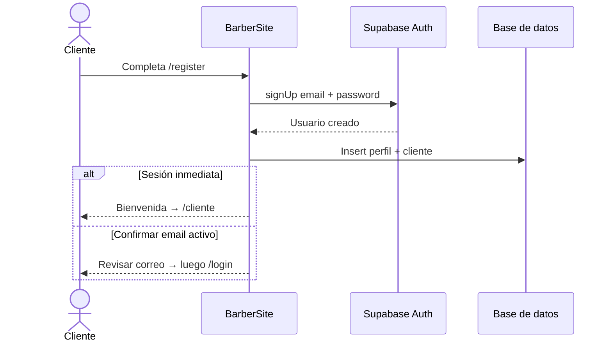

### 2.3 Recuperación de contraseña

> **Importante:** En la versión actual **no hay botón “Olvidé mi contraseña”** en la pantalla de login.

Opciones disponibles hoy:

| Situación | Qué hacer |
|-----------|-----------|
| Cliente olvidó clave | Contactar a la barbería; un admin puede crear una nueva clave desde **Usuarios** (usuario staff) o restablecer desde el panel de **Supabase** (técnico). |
| Empleado olvidó clave | El administrador edita o recrea acceso en **Admin → Usuarios**. |
| Confirmación por correo | Si al registrarse Supabase exige confirmar email, el cliente debe abrir el enlace del correo antes de poder entrar (según configuración del proyecto). |

*Mejora futura recomendada:* activar “Reset password” de Supabase Auth y enlazarlo en `/login`.

#### Diagrama: ¿olvidé mi contraseña? (hoy)

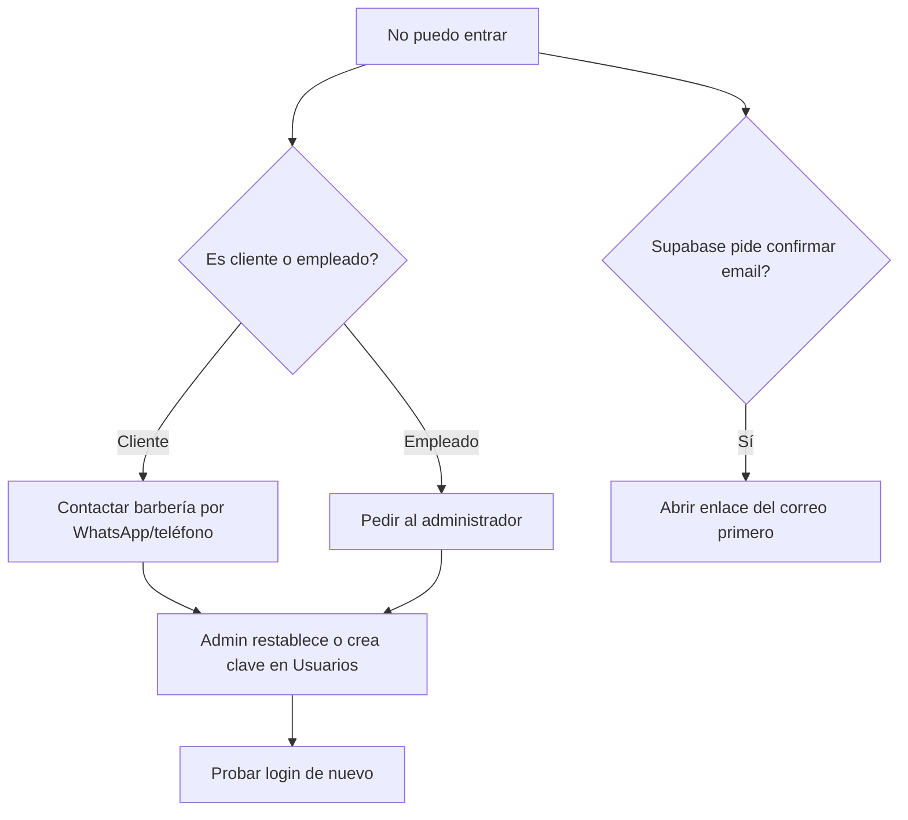

### 2.4 Cerrar sesión

1. En escritorio: icono de **usuario** (esquina superior derecha) → **Cerrar sesión**.
2. En móvil: use el menú inferior y, si aplica, el mismo menú de usuario.

Al cerrar sesión se invalida la sesión en ese navegador.

---

## 3. Perfil administrador

El administrador tiene control total del negocio. El menú lateral está organizado en tres bloques: **Operación**, **Catálogo** y **Administración**.

### 3.1 Panel principal (`/admin`)

Al entrar verá:

- **KPIs del día** (clicables):
  - Ventas de hoy → Reportes
  - Citas hoy → Agenda general
  - Total clientes → Usuarios / base de clientes
  - Stock en alerta → Inventario
- **Acciones rápidas:** Agenda, Recepción, Nueva venta (POS), Asistencia
- **Tabla de citas de hoy**
- **Resumen de personal** (en turno / sin salida)
- **Centro de alertas** (stock, turnos abiertos, pedidos pendientes)

**Flujo recomendado al abrir el local:**

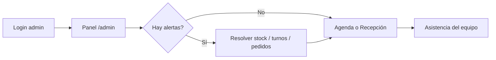

#### Diagrama: menú administrador

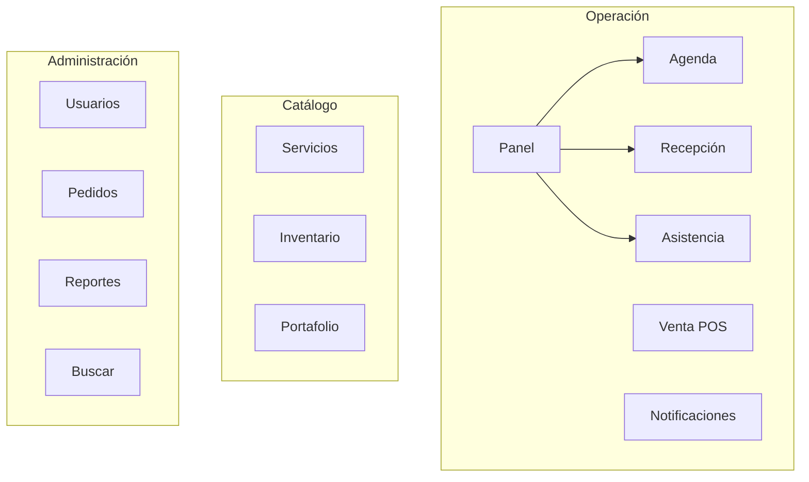

### 3.2 Creación de nuevos usuarios (staff)

Ruta: **Administración → Usuarios** (`/admin/usuarios`)

#### Crear barbero, recepcionista u otro admin

1. Pulse **+ Nuevo usuario** (o equivalente en la pantalla).
2. Complete el formulario:
   - **Nombre completo**
   - **Correo corporativo** (será el login)
   - **Contraseña temporal** (mínimo según política de Supabase)
   - **Teléfono** (opcional)
   - **Rol:** `barbero`, `recepcionista` o `admin`
   - **Comisión %** (barberos; ej. 30)
   - **URL de avatar** (opcional)
3. Guarde.

El sistema crea la cuenta de acceso y el perfil. Entregue al empleado su correo y contraseña temporal; pídale que la cambie en cuanto haya opción de hacerlo (vía soporte técnico hoy).

#### Diagrama: alta de usuario staff (admin)

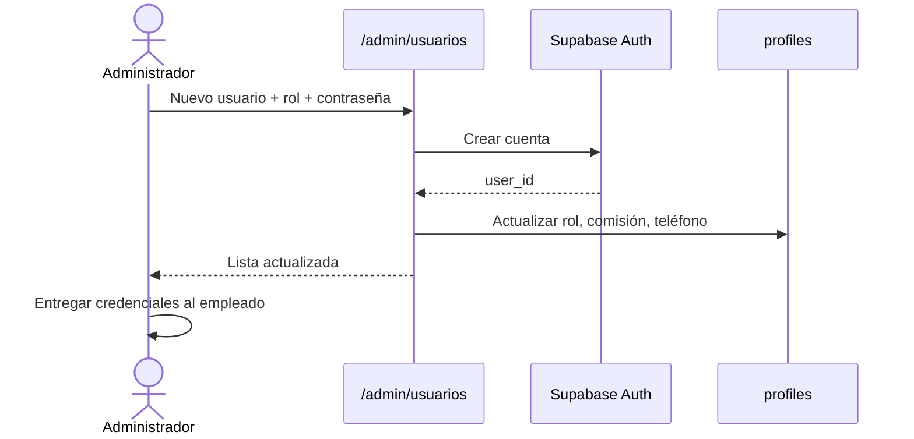

#### Editar usuario existente

1. En la lista de usuarios, pulse **Editar** (icono lápiz).
2. Modifique nombre, teléfono, rol, comisión o avatar.
3. Guarde.

> No se edita el correo de login desde esta pantalla en todos los casos; si debe cambiar el email de acceso, consulte soporte técnico (Supabase Auth).

#### Desactivar / eliminar

- Use las opciones de la lista (eliminar o desactivar según lo implementado en pantalla).
- Antes de eliminar un barbero con citas futuras, reasigne o cancele esas citas.

### 3.3 Gestión de clientes

Los **clientes** se crean principalmente por:

1. **Auto-registro** en `/register` (rol cliente automático).
2. **Reserva o venta** en `/reservar` (se crea o vincula registro en tabla `clientes`).
3. **Migración Excel** (herramienta en carpeta `scripts/` del proyecto técnico).

**Consulta y búsqueda:**

- **Admin → Buscar** (`/admin/buscar`): busca por nombre, teléfono, email o referencia de cita.
- Los datos de lealtad (visitas, gasto) se actualizan al **finalizar citas** en recepción.

> **Pendiente en roadmap:** fusión de clientes antiguos/nuevos por número de carnet.

### 3.4 Gestión de reservas y calendario general

#### Agenda general (`/agenda`)

- Vista de **todos los barberos** (colores distintos por barbero).
- Cambie entre vistas **día / semana / mes** según los controles del calendario.
- Pulse una cita para ver detalle en modal.
- La agenda se actualiza automáticamente cada ~30 segundos.

#### Crear cita desde el sistema (staff)

Ruta: **Operación → Venta / POS** (`/reservar`)

1. Inicie sesión como admin o recepcionista.
2. Complete datos del cliente (o seleccione usuario logueado si aplica).
3. Elija **servicio**, **barbero**, **fecha** y **hora**.
4. Confirme.

Se envían notificaciones al barbero, administración y correos al cliente (si Resend está configurado).

#### Cancelar citas

- **Recepción:** botón Cancelar en la tarjeta de la cita (usa API segura).
- **Cliente:** desde **Mis citas** (`/cliente`) en citas futuras.
- **Admin / barbero asignado:** vía recepción o flujos con permiso en API.

Estados de una cita:

| Estado | Significado |
|--------|-------------|
| `pendiente` | Agendada, no iniciada |
| `confirmado` | Confirmada (si se usa) |
| `en_proceso` | Cliente en sillón |
| `completado` | Servicio cobrado |
| `cancelado` | Anulada |

#### Diagrama: ciclo de vida de una cita

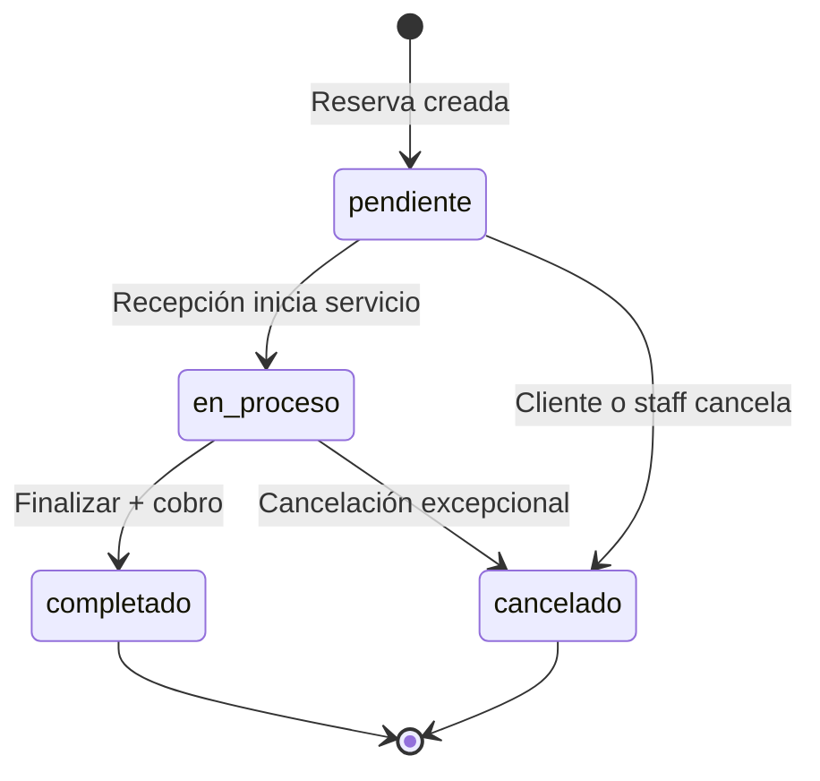

#### Diagrama: reserva nueva (cliente o POS)

```mermaid
flowchart TD
  S[Inicio reserva] --> L{Usuario logueado?}
  L -->|No| LOGIN[/login o /register]
  L -->|Sí| S1[Elegir servicio]
  LOGIN --> S1
  S1 --> S2[Elegir barbero]
  S2 --> S3[Elegir fecha y hora libre]
  S3 --> S4[Confirmar datos]
  S4 --> S5[Guardar cita]
  S5 --> N[Notificaciones: barbero, admin, email]
  N --> OK[Confirmación en pantalla]
```

### 3.5 Recepción y ventas (`/recepcion`)

Aunque el admin puede entrar aquí, es el módulo principal de **recepcionistas**.

- Filtro por **día, semana o mes**
- Lista de citas con acciones: **Iniciar**, **Finalizar**, **Cancelar**
- Al **finalizar**: método de pago, propinas, actualización de lealtad
- Resumen de ventas del período visible en la misma pantalla

### 3.6 Control de asistencia (`/admin/asistencia`)

Panel completo para el administrador:

| Función | Descripción |
|---------|-------------|
| Ver todas las asistencias | Filtros por fecha, barbero, estado |
| Turnos abiertos | Alerta si hay entrada sin salida |
| Editar registro | Corregir hora entrada/salida, horas trabajadas |
| Cierre automático | Sistema marca salida a las **22:00** (hora Bolivia) |
| Exportar CSV | Descarga para nómina o archivo |

**Regla de negocio:** Después de las **22:00**, el empleado **no puede** marcar salida desde su widget; solo el admin corrige en este panel.

### 3.7 Gestión de catálogo

| Módulo | Ruta | Uso |
|--------|------|-----|
| Servicios | `/admin/servicios` | Precio, duración, activar/desactivar |
| Inventario | `/admin/productos` | Stock, alertas de stock bajo |
| Portafolio | `/admin/portafolio` | Fotos de trabajos (URLs); aparecen en landing |
| Pedidos tienda | `/admin/pedidos` | Pedidos online: pendiente, confirmado, entregado |

### 3.8 Notificaciones (`/notificaciones`)

- Historial con filtros (todas / no leídas / por categoría)
- Marcar como leídas
- Pestaña **Preferencias**: activar o desactivar avisos in-app y por email

La **campana** (icono superior) muestra las últimas alertas en tiempo real si Realtime está activo en Supabase.

### 3.9 Reportes (`/admin/reportes`)

Gráficos y métricas de ventas, servicios y desempeño. Use este módulo para cierre de caja y análisis mensual.

### 3.10 Configuraciones del sistema

| Tipo | Dónde se configura |
|------|-------------------|
| Correo admin, redes, teléfono | Tabla `configuracion` en Supabase y variables `.env` en servidor |
| Auth (confirmar email, URLs) | Panel Supabase → Authentication |
| Recordatorios automáticos | Cron que llama `/api/notificaciones/recordatorios?secret=...` |
| Horario de cierre asistencia | 22:00 — constante del sistema (`America/La_Paz`) |

No hay pantalla única “Configuración general” en la app; el admin gestiona catálogos desde los módulos del menú.

### 3.11 Gestión de horarios por barbero

Ruta: **Agenda → seleccionar barbero** o `/agenda/[id-del-barbero]` → pestaña **Horarios y bloqueos**

- **Horario semanal:** días activos, hora inicio y fin
- **Bloqueos:** vacaciones, día libre o bloqueo puntual

Al guardar horario, el barbero recibe notificación de cambio.

---

## 4. Perfil recepcionista

El recepcionista opera el día a día del salón.

### 4.1 Menú disponible

- Agenda general
- Recepción
- Venta / POS
- Notificaciones

### 4.2 Flujo típico de un día

1. **Login** → llega a `/recepcion`
2. Marca **entrada** en el widget de asistencia (parte superior o lateral)
3. Revisa citas del día (vista **día**)
4. Cuando llega el cliente: marca cita **En proceso**
5. Al terminar: **Finalizar** → pago y propina
6. Walk-in sin cita: **Venta / POS** o panel barbero (según procedimiento del local)
7. Al cerrar local: **Marcar salida** (antes de las 22:00)

#### Diagrama: jornada de recepción (timeline)

```mermaid
gantt
  title Ejemplo de jornada — Recepción
  dateFormat HH:mm
  axisFormat %H:%M
  section Apertura
  Marcar entrada           :a1, 09:00, 15m
  Revisar citas del día    :a2, after a1, 30m
  section Operación
  Atender citas en proceso :a3, 09:45, 11h
  section Cierre
  Marcar salida            :a4, 20:30, 15m
```

#### Diagrama: atención de un cliente en recepción

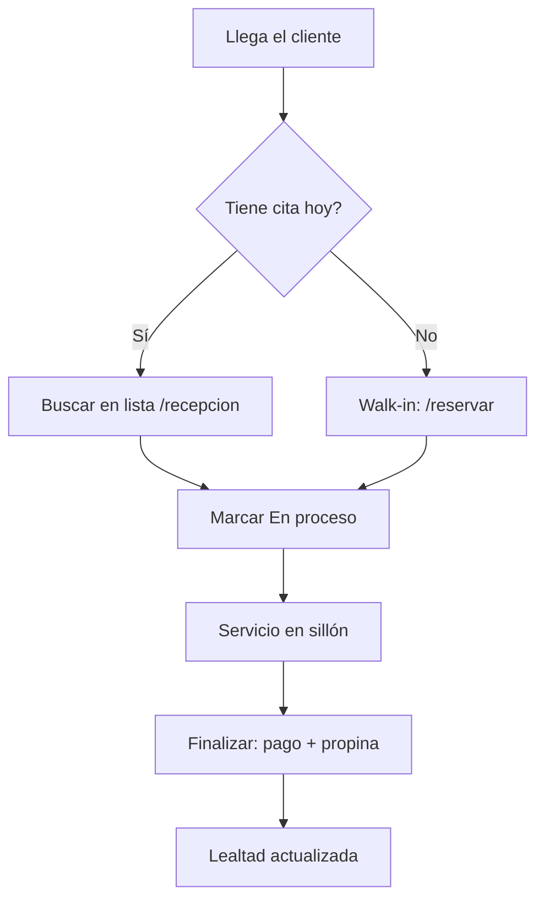

### 4.3 Agenda y filtros

En **Recepción** puede cambiar a vista **semana** o **mes** para planificar.

En **Agenda** (`/agenda`) ve el calendario visual multi-barbero.

---

## 5. Perfil barbero

### 5.1 Panel personal (`/barbero`)

```mermaid
flowchart LR
  B[/barbero] --> A[Mi agenda]
  B --> W[Walk-in]
  B --> AS[Asistencia]
  A --> T1[Calendario]
  A --> T2[Disponibilidad]
  A --> T3[Horarios y bloqueos]
```

- Resumen de citas del día
- Acceso rápido a **Mi agenda**
- **Walk-in** (cliente sin cita): registro rápido y cobro
- Widget de **asistencia**

### 5.2 Mi agenda (`/agenda/[id-del-barbero]`)

Pestañas:

| Pestaña | Función |
|---------|---------|
| **Calendario** | Ver citas en día/semana/mes; abrir detalle |
| **Disponibilidad** | Ver huecos libres |
| **Horarios y bloqueos** | Ajustar semana laboral o marcar día libre (si tiene permiso) |

> Admin y recepción también pueden abrir la agenda de cualquier barbero desde la agenda general.

### 5.3 Marcado de asistencia

En el widget **Mi asistencia**:

1. Al llegar: **Marcar entrada** (si llega tarde, el sistema puede marcar **atrasado**)
2. Durante el turno: se muestra tiempo transcurrido
3. Al irse: **Marcar salida** (antes de las 22:00)
4. Si olvidó marcar salida: el sistema cierra a las 22:00; avisar al admin para corrección

Estados visibles: **Presente**, **Atrasado**, **Ausente**, **Turno finalizado**.

### 5.4 Notificaciones

- Nueva cita asignada a usted
- Cambios de horario
- Recordatorios de citas del día siguiente (email + in-app si están activos)

Revise la **campana** y `/notificaciones`.

### 5.5 Actualización de información personal

Hoy la edición de perfil (nombre, teléfono, foto) la realiza principalmente el **administrador** en **Usuarios**. El barbero puede consultar su nombre en el encabezado del dashboard.

---

## 6. Perfil cliente

### 6.1 Registro de nueva cuenta

Ruta: **`/register`** (enlace “Regístrate” desde login o landing)

1. Complete: **nombre**, **teléfono**, **email**, **contraseña**
2. Pulse registrarse
3. Dos resultados posibles:
   - **Sesión inmediata:** mensaje de bienvenida y redirección a `/cliente`
   - **Confirmar email:** pantalla de bienvenida pidiendo revisar el correo (según Supabase)

El sistema crea usuario Auth + perfil + registro en tabla **clientes**.

### 6.2 Verificación de correo

Si el administrador técnico activó **“Confirm email”** en Supabase:

- El cliente debe abrir el enlace del correo antes del primer login.
- Si no llega el correo, revisar spam o pedir al admin reenviar desde Supabase.

### 6.3 Inicio de sesión

`/login` con email y contraseña → redirección a **`/cliente`**.

### 6.4 Panel del cliente (`/cliente`)

- **Próximas citas** con opción **Cancelar**
- **Historial** de citas pasadas
- **Club de lealtad** (progreso de visitas y beneficios)
- Envío de **testimonio** tras servicios (estrellas y comentario)

### 6.5 Reservar cita (`/reservar`)

> Requiere **iniciar sesión**.

#### Diagrama: experiencia del cliente (viaje completo)

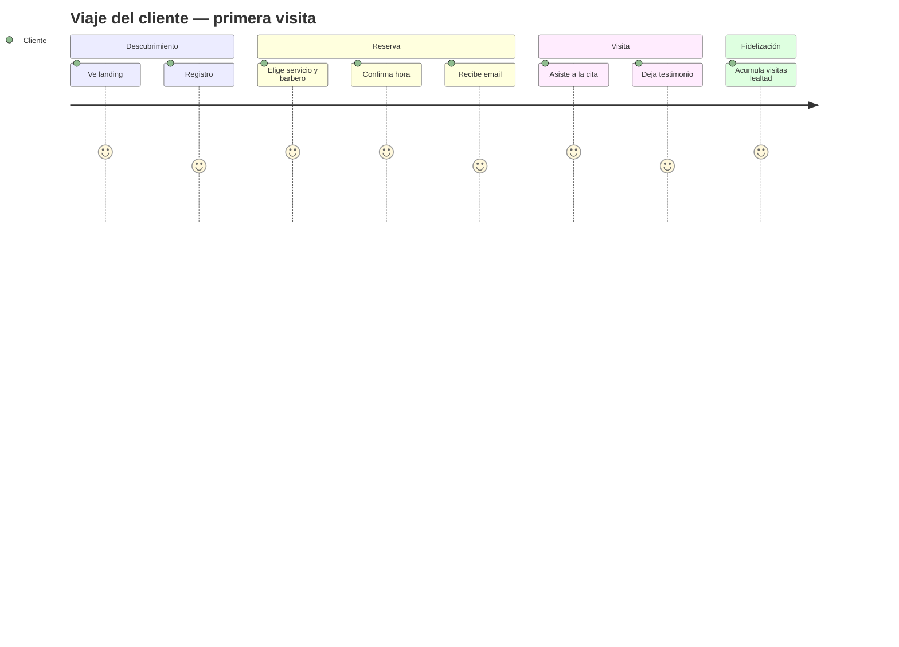

Pasos:

1. Seleccione **servicio** (precio y duración se muestran)
2. Elija **barbero**
3. Elija **fecha** y **hora** disponible
4. Confirme datos de contacto
5. Confirme reserva

Si tiene promoción de lealtad activa, el descuento puede aplicarse automáticamente.

Recibirá confirmación por **notificación** y **correo** (si está configurado).

### 6.6 Calendario (`/calendario`)

Vista autenticada para consultar disponibilidad y contexto de citas (complementa `/cliente`).

### 6.7 Cancelación y reprogramación

| Acción | Cómo |
|--------|------|
| **Cancelar** | En `/cliente`, botón Cancelar en cita futura |
| **Reprogramar** | **No hay botón dedicado.** Cancele la cita y cree una nueva en `/reservar`, o llame a la barbería para que recepción/admin la cambie |

### 6.8 Tienda (`/tienda`)

- Navegar productos, carrito y checkout
- Pedido notifica a admin/recepción y envía correo si está configurado

### 6.9 Datos personales

Nombre y teléfono quedan asociados a la cuenta. Para cambios sensibles (email de login), contacte a la barbería.

---

## 7. Sistema de notificaciones

### 7.1 Notificaciones en tiempo real (in-app)

- Icono de **campana** en la barra superior (usuarios logueados)
- Badge con cantidad de no leídas
- Clic en una notificación → marca leída y abre enlace si existe
- **Ver historial completo** → `/notificaciones`

Requiere Realtime activado en Supabase para la tabla `notificaciones`.

### 7.2 Notificaciones por correo

Servicio: **Resend** (configurado en el servidor).

| Evento | Destinatarios típicos |
|--------|------------------------|
| Nueva reserva | Cliente, barbero, admin |
| Cancelación | Cliente, barbero, admin |
| Pedido tienda | Cliente, admin |
| Recordatorio 24 h | Cliente, barbero |
| Cambio de horario | Barbero afectado |
| Asistencia / alertas | Admin |

Plantillas con diseño profesional (tema oscuro / ámbar).

### 7.3 Panel de notificaciones y preferencias

En `/notificaciones`:

- **Historial:** filtros y marcar todas leídas
- **Preferencias:**
  - Push in-app: reservas, ventas, recordatorios, alertas
  - Email: mismas categorías

Si desactiva una categoría, no recibirá ese tipo de aviso (según canal).

### 7.4 Recordatorios automáticos

El sistema puede enviar recordatorios de citas en las próximas 24 horas mediante un proceso programado (cron) que llama al endpoint de recordatorios del servidor. Debe configurarlo el técnico en Vercel o un servicio externo.

#### Diagrama: flujo de notificaciones (evento → canales)

```mermaid
flowchart TB
  E[Evento del sistema\nreserva, venta, asistencia...] --> D[Motor dispatch]
  D --> P{Preferencias usuario}
  P -->|Push activo| APP[(Tabla notificaciones)]
  P -->|Email activo| MAIL[Resend]
  APP --> CAMP[Campana en tiempo real]
  APP --> HIST[/notificaciones]
  MAIL --> INBOX[Correo del usuario]
  D --> ROL[Notificación por rol\nadmin / recepción]
```

#### Diagrama: quién recibe qué (reserva nueva)

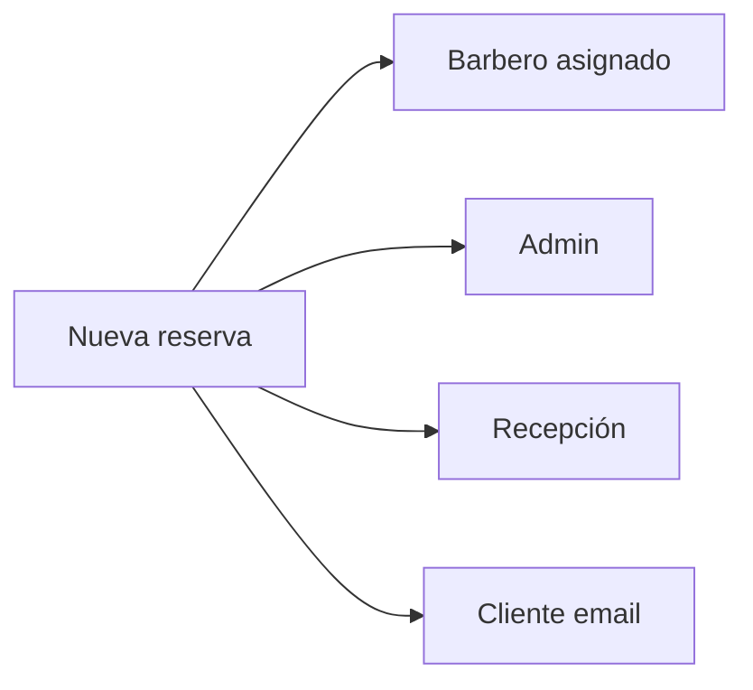

---

## 8. Control de asistencia

### 8.1 Marcado de entrada y salida

**Quién marca:** barberos y recepcionistas (no admin ni clientes).

**Dónde:** widget en panel barbero, recepción o dashboard según rol.

### 8.2 Regla de las 22:00 (10:00 PM)

- Zona horaria del negocio: **America/La_Paz**
- Si hay **entrada sin salida** a las **22:00**, el sistema registra **salida automática** y marca el turno como finalizado con flag de cierre automático
- Después de las 22:00 el empleado **no puede** marcar salida; debe pedir corrección al admin

### 8.3 Correcciones manuales (admin)

`/admin/asistencia` → seleccionar registro → editar horas → guardar.

Queda indicado si el registro fue **editado por administración** o **cerrado automáticamente**.

### 8.4 Retrasos

Entrada después de las **09:15** (configuración actual) puede registrarse como **atrasado** y notificar al admin.

#### Diagrama: línea de tiempo del turno

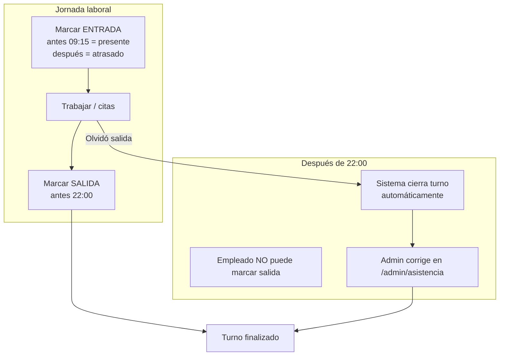

#### Diagrama: estados de asistencia

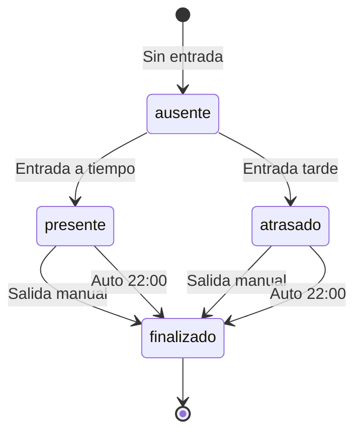

---

## 9. Sitio público (sin login)

| Sección | Contenido |
|---------|-----------|
| Inicio `/` | Servicios, equipo, portafolio/carrusel, tienda, contacto, redes |
| Galería `/galeria` | Trabajos del portafolio |
| Tienda `/tienda` | Catálogo (checkout pide login según flujo) |
| Reservar | Redirige a login si no hay sesión |

Botón flotante de **WhatsApp** (si está configurado en variables de entorno o tabla `configuracion`).

#### Diagrama: recorrido visitante sin cuenta

```mermaid
flowchart TD
  V[Visitante en /] --> R{Qué quiere?}
  R -->|Ver trabajos| G[/galeria]
  R -->|Comprar| T[/tienda]
  R -->|Reservar| L{Tiene cuenta?}
  L -->|No| REG[/register]
  L -->|Sí| LOG[/login]
  REG & LOG --> RES[/reservar]
```

---

## 10. Recomendaciones y seguridad

### 10.1 Buenas prácticas

- Un usuario = una persona (no compartir cuentas de barbero)
- Cierre de caja diario con **Reportes** y recepción
- Revisar stock bajo cada mañana
- Respaldar base Supabase periódicamente (técnico)
- Probar reserva y correo después de cada despliegue nuevo

### 10.2 Contraseñas

- Mínimo 8 caracteres, mezcla de letras y números
- No reutilizar contraseña de correo personal
- Admin: entregar contraseña temporal y pedir cambio en primera semana

### 10.3 Sesiones

- Cerrar sesión en PC compartida de recepción
- No guardar contraseña en navegadores públicos

### 10.4 Para administradores

- Limite cuentas **admin** a personas de confianza
- Revise usuarios inactivos mensualmente
- Mantenga `ADMIN_NOTIFICATION_EMAIL` actualizado en Vercel
- No comparta `SUPABASE_SERVICE_ROLE_KEY` ni `RESEND_API_KEY`

### 10.5 Mantenimiento

| Frecuencia | Tarea |
|------------|--------|
| Diario | Revisar agenda, asistencia, pedidos pendientes |
| Semanal | Reportes, inventario, portafolio |
| Mensual | Usuarios, respaldo DB, revisar logs Vercel |

---

## 11. Funciones pendientes o limitadas

Documentado para evitar confusiones en capacitación:

| Función | Estado |
|---------|--------|
| Recuperar contraseña desde la app | No implementado en UI |
| Reprogramar cita (cliente) | Cancelar + nueva reserva o gestión por staff |
| Pago en línea (Stripe/MercadoPago) | Pendiente |
| WhatsApp automático | Pendiente |
| Fusión clientes por carnet | Pendiente |
| Pantalla única de configuración | Parcial (módulos + Supabase + env) |

---

## 12. Soporte, glosario y FAQ

### Preguntas frecuentes (FAQ)

| Pregunta | Respuesta |
|----------|-----------|
| ¿Por qué no me deja reservar? | Debe iniciar sesión. Verifique horario disponible del barbero. |
| ¿No llegó el correo de confirmación? | Revise spam. Verifique Resend en servidor. Confirme email en Supabase si aplica. |
| ¿Puedo cambiar la hora de mi cita? | Cancele en `/cliente` y reserve de nuevo, o llame a la barbería. |
| ¿Por qué no puedo marcar salida? | Después de las 22:00 solo el admin puede corregir. |
| ¿La campana no se actualiza sola? | Active Realtime en Supabase para `notificaciones`. |
| ¿Cómo creo un barbero nuevo? | Solo admin en `/admin/usuarios`. |
| ¿Dónde veo ventas del día? | Recepción o admin → Reportes. |

### Glosario

| Término | Significado |
|---------|-------------|
| POS | Punto de venta; pantalla `/reservar` para cobros y citas |
| Walk-in | Cliente sin cita previa |
| KPI | Indicador en panel admin (ventas, citas, etc.) |
| RLS | Seguridad en base de datos por rol |
| Realtime | Actualización instantánea de notificaciones |

### Contacto técnico

Para fallos de acceso, correos que no llegan o despliegue en Vercel: contacte al equipo de desarrollo (**k3v1bvo Studios**) con captura de pantalla, correo del usuario y hora del incidente.

---

## 13. Anexo: índice de diagramas

| # | Diagrama | Sección |
|---|----------|---------|
| 1 | Arquitectura general (capas) | [1.6](#16-diagramas-y-mapas-del-sistema) |
| 2 | Mapa del sitio (mindmap) | [1.6](#16-diagramas-y-mapas-del-sistema) |
| 3 | Matriz de permisos | [1.6](#16-diagramas-y-mapas-del-sistema) |
| 4 | Referencia rápida por rol | [1.7](#17-referencia-rápida-por-rol) |
| 5 | Login y redirección | [2.2](#22-inicio-de-sesión-todos-los-roles) |
| 6 | Registro cliente (secuencia) | [2.2](#22-inicio-de-sesión-todos-los-roles) |
| 7 | Olvidé contraseña | [2.3](#23-recuperación-de-contraseña) |
| 8 | Rutina admin mañana | [3.1](#31-panel-principal-admin) |
| 9 | Menú administrador | [3.1](#31-panel-principal-admin) |
| 10 | Alta usuario staff | [3.2](#32-creación-de-nuevos-usuarios-staff) |
| 11 | Ciclo de vida de cita | [3.4](#34-gestión-de-reservas-y-calendario-general) |
| 12 | Flujo reserva nueva | [3.4](#34-gestión-de-reservas-y-calendario-general) |
| 13 | Jornada recepción (Gantt) | [4.2](#42-flujo-típico-de-un-día) |
| 14 | Atención cliente recepción | [4.2](#42-flujo-típico-de-un-día) |
| 15 | Panel barbero | [5.1](#51-panel-personal-barbero) |
| 16 | Viaje del cliente (journey) | [6.5](#65-reservar-cita-reservar) |
| 17 | Motor de notificaciones | [7.4](#74-recordatorios-automáticos) |
| 18 | Destinatarios reserva nueva | [7.4](#74-recordatorios-automáticos) |
| 19 | Timeline turno asistencia | [8.4](#84-retrasos) |
| 20 | Estados de asistencia | [8.4](#84-retrasos) |
| 21 | Visitante sitio público | [9](#9-sitio-público-sin-login) |

### Leyenda visual en calendarios

| Elemento | Significado |
|----------|-------------|
| Color por barbero | Cada profesional tiene un color en agenda general |
| Badge estado | pendiente / en proceso / completado / cancelado |
| Vista día | Operación hora a hora |
| Vista semana | Planificación recepción |
| Vista mes | Visión global |

---

**Fin del manual de usuario — BarberSite Pro v1.1**

*Documento alineado con el código desplegado en rama `main` del repositorio BarberSite. Incluye 21 diagramas de uso y referencias rápidas.*
